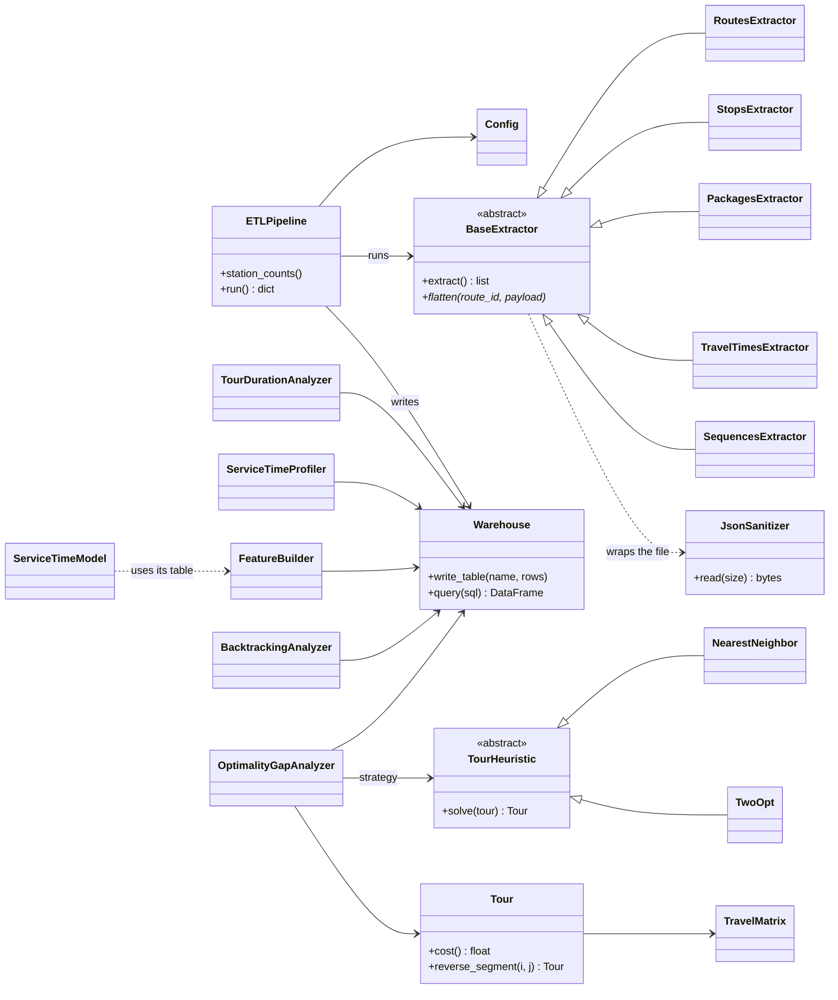

# LastMile-Kaizen

**Where does the time go in an Amazon delivery and how can we minimize it?**

## Key findings : station DLA8
- A tour lasts **7.5h** on average: 2.26h driving + 5.26h service time
- Service time is almost entirely driven by **the number of packages** & other features only count for **6%** of predictive accuracy
- Drivers route efficiently (a greedy algorithm is **12%** worse)
- Routes are on average **6.7%** above a 2-opt optimised route

**Conclusion:** The routing problem is real but marginal: drivers are already **close to optimal** and driving is only **30%** of the day. The variables Amazon records can not explain the service time.
---

## Table of contents
1. [Context]
2. [Data]
3. [Architecture]
4. [Set Up]
5. [Phase 0: Pipeline]
6. [Measure: tour duration baseline]
7. [Analyze 1: service time]
8. [Analyze 2: backtracking index]
9. [Analyze 3: optimality gap]
10. [Limitations]
11. [Lessons learned]
12. [Roadmap]

---

## 1. Context
The Amazon Last Mile Routing Research Challenge released real delivery routes and asked participants to **reproduce the stop sequences of experienced drivers**. The winning used a local-search TSP solver from the LKH family.
This project takes a complementary angle: measure where the time actually goes, then use the same operations-research tools as a measuring instrument rather than as a route generato.
The work follows the DMAIC structure of Lean Six Sigma.

---

## 2. Data

* **Source:** `s3://amazon-last-mile-challenges/almrrc2021/`
* **Licence:** Creative Commons BY-NC 4.0
* **Coverage:** 6,112 routes from 17 stations
| `route_data.json` | 75 MB | route metadata + nested stops (coordinates, type, zone) |
| `package_data.json` | 358 MB | packages per stop: scan status, time window, planned service time, dimensions |
| `travel_times.json` | **1.7 GB** | full stop-to-stop travel-time matrix of every route |
| `actual_sequences.json` | 9 MB | visit order actually driven |

The files are **monolithic** (all routes in one JSON object) and **deeply nested** (route → stop → package → sub-dictionaries).

---

## 3.Architecture
```
lastmile-kaizen/
├── pyproject.toml
├── README.md
├── samples/                      # tiny versions of the 4 files (tracked, used by tests)
├── data/                         # real files (git-ignored)
├── src/lastmile_kaizen/
│   ├── config.py                 
│   ├── cli.py                    
│   ├── ingestion/
│   │   ├── sanitizer.py          # JsonSanitizer: streaming NaN -> null
│   │   ├── extractors.py         # BaseExtractor + one subclass per table
│   │   └── pipeline.py           # ETLPipeline: extract -> flatten -> load
│   ├── storage/
│   │   └── warehouse.py          # Warehouse: DuckDB gateway (context manager)
│   ├── analysis/
│   │   ├── tour_duration.py      # TourDurationAnalyzer (Measure)
│   │   ├── service_profile.py    # ServiceTimeProfiler (distribution, cleaning impact)
│   │   ├── features.py           # FeatureBuilder (stop-level training table)
│   │   └── backtracking.py       # BacktrackingAnalyzer (zone re-entries)
│   ├── modeling/
│   │   └── service_model.py      # ServiceTimeModel (feature-set comparison)
│   └── optimization/
│       ├── tour.py               # TravelMatrix, Tour (graph model, objective function)
│       ├── heuristics.py         # TourHeuristic -> NearestNeighbor, TwoOpt (Strategy)
│       └── gap.py                # OptimalityGapAnalyzer
└── tests/                        # 78 pytest tests
```



## 4. Set Up
Requirements: [uv](https://docs.astral.sh/uv/) and the [AWS CLI v2](https://docs.aws.amazon.com/cli/) (no AWS account needed).

```bash
git clone https://github.com/<your-user>/lastmile-kaizen.git
cd lastmile-kaizen
uv sync

uv run lastmile build --data-dir samples --stations DAU1 --db samples.duckdb
uv run lastmile gap   --data-dir samples --stations DAU1 --db samples.duckdb

mkdir -p data
for f in route_data package_data travel_times actual_sequences; do
  aws s3 cp --no-sign-request \
    s3://amazon-last-mile-challenges/almrrc2021/almrrc2021-data-training/model_build_inputs/$f.json data/
done

uv run lastmile stations                          # routes per station (discovery)
uv run lastmile build --stations DLA8             # stream into lastmile.duckdb (few minutes)
uv run lastmile measure                           # tour duration baseline
uv run lastmile service                           # service-time profiling + model comparison
uv run lastmile backtracking --granularity sub_zone
uv run lastmile gap --output gap_dla8.csv         # 2-opt on every route (~2 min)
uv run lastmile gap --route <route_id>            # one route: driver vs nearest neighbour vs 2-opt

uv run pytest                                     # 78 tests
```

## 5. Phase 0: Pipeline
### 5.1 Data model
Dealing with JSON has been a real challenge at first since nested JSON connot be queried efficiently so each nesting level becomes its own table.
| `routes` | route | `route_id` | 448 |
| `stops` | stop | `(route_id, stop_id)` | 57,807 |
| `packages` | package | `(route_id, stop_id, package_id)` | 111,154 |
| `travel_times` | arc of the matrix | `(route_id, from_stop, to_stop)` | 7,906,583 |
| `sequences` | stop | `(route_id, stop_id)` | 57,807 |

Identifiers are carried by the JSON keys, not by the values. Sub-dictionaries are spread over several columns.
**Consistency checks:** 'stops == sequences' and 'travel_times ≈ Σ n_stops'
### 5.2 Streaming: the memory wall, measured
'json.load' materialises the whole file as Python objects.
| `json.load` | 138 MB | ×5.4 the file size |
| `ijson` (streaming, one route at a time) | 2.1 MB | **67× less**, independent of file size |

Extrapolated to the real 1.7 GB file, `json.load` would need **~9.2 GB of RAM**.
### 5.3 The `NaN` problem
The files were written with bare 'NaN' tokens which are **not valid JSON**.
`JsonSanitizer` rewrites `NaN` into `null` on the byte stream, without ever loading the whole file.
## 5.4 Other notes
* ijson returns 'Decimal' numbers. They are converted to 'float' at extraction, otherwise DuckDB types the columns as 'DECIMAL'
* 'con.register(df)': only a view, not persistent.

## 6. Measure: tour duration baseline
The objective function of a tour is the sum of travel times over consecutives stops, computed in SQL with a self-join on 'visit_order + 1'. Service time is the sum of 'planned_service_time_seconds'.
| Driving time | **2.26 h** mean (min 0.89 h, max 4.15 h) |
| Service time | **5.24 h** mean |
| Total tour | **7.5 h** mean (longest: 10.6 h = 2.2 h driving + 8.4 h service) |
| Service share | **69.9 %** |

## 7. Analyze 1: service time
### 7.1 Profile before cleaning
| Packages | 111,154 |
| Distinct values | **2,199** (a rich continuous variable, not a lookup table: modelling is worthwhile) |
| Min / max | 0.8 s / **8,007 s** |
| Mean / median | 76.0 s / 58.7 s (right-skewed: a minority of slow packages pulls the mean up) |

The slowest packages (2,200 to 8,000 s for **one** package) have ordinary volumes (3 to 34 litres) and 9 out of 10 are `DELIVERED`: neither size nor delivery failure explains them, and two hours for one parcel is physically implausible, so they are treated as data artefacts. At the other end, the 35 packages under 5 s are mostly `DELIVERED` (32 of 35), which **refuted** the initial hypothesis that they were failed attempts.
### 7.2 Cleaning rule
| All | 111,154 | |
| `scan_status = DELIVERED` | 109,412 | 1,742 (1.57 %): attempts and rejections are not deliveries |
| service time between 5 s and 15 min | 109,315 | 97 (0.09 %): implausible values |

**98.3 % of the data is kept.** The business rule (delivered only) does 95 % of the cleaning; the plausibility cap is a safety net.
### 7.3 Unit of analysis and feature table
A driver parks once per **stop**, not per package, so the target is the total service time of a stop. The `features` table holds **56,630 stops** (stops with at least one clean package) with: `n_packages`, `volume_total_l`, `visit_order`, and the zone at two granularities.
### 7.4 Zone granularity and confounding
`zone_id` (e.g. `C-4.2D`) has **3,758** distinct values: too many to learn from. Three granularities were compared:
| full zone | `C-4.2D` | 3,758 (unusable) |
| letter | `C` | 10 |
| sub-zone | `C-4` | 217; the 154 seen ≥ 100 times cover **94.0 %** of stops, the rest is grouped into `OTHER` (155 categories) |

At letter level, mean service **per stop** ranged from 111 s (zone L) to 185 s (zone H), a 67 % spread that looked like a strong signal. Measured **per package**, the spread collapsed to 73 s (E) to 92 s (J): the "slow" zones were mostly zones with more packages per stop. The finer granularity does carry signal that the letter hid.
### 7.5 Model comparison
| Features | MAE | Gain vs baseline |
|---|---|---|
| 1. baseline: `n_packages` only | 72 s | |
| 2. + volume, visit order, zone letter | 70 s | −2.8 % |
| 3. + volume, visit order, grouped sub-zone | 68 s | −5.6 % |

**Conclusion.** Planned service time is essentially proportional to the number of packages. The recorded variables do not explain the rest; the levers lie in unrecorded variables (building type, floor, elevator, parking, customer presence).

## 8. Analyze 2: backtracking index
**Definition:**`backtracking = blocks − distinct zones`: 0 if every zone is served in one contiguous block, +1 per re-entry.

| Granularity (prototype) | Mean | Max | Clean (0–1) | Pathological (10+) |
|---|---|---|---|---|
| letter `C` | 2.06 | 36 | 55.4 % | 3.6 % |
| cell `C-4.2` | 12.03 | 44 | 0 % | 70.3 % |

Because no zone level is "the truth", the objective measure of wasted driving is the optimality gap below, which does not depend on any zone definition.

---
## 9. Analyze 3: optimality gap (operations research)
### 9.1 Formulation
A route is a weighted complete digraph *G = (V, A)*: vertices are stops, arc weights *c<sub>ij</sub>* are travel times. The matrix is **asymmetric** (*c<sub>ij</sub> ≠ c<sub>ji</sub>*), so this is an **asymmetric TSP**; the actual route is one Hamiltonian path among (*n*−1)! possible ones. As an integer linear program (MTZ formulation):

$$\min \sum_{i}\sum_{j} c_{ij}\,x_{ij}$$

$$\sum_{j} x_{ij} = 1 \;\; \forall i, \qquad \sum_{i} x_{ij} = 1 \;\; \forall j, \qquad u_i - u_j + n\,x_{ij} \le n-1 \;\; \forall i \ne j,\ i,j \ge 2, \qquad x_{ij} \in \{0,1\}$$

(the open-path variant used here is obtained with a dummy return node of zero cost). The gap of a route is

$$\text{gap} = f(\text{actual}) - f(\text{optimised})$$
### 9.2 Why a heuristic
The TSP is NP-hard. Exact methods exist (ILP with branch-and-bound; Held-Karp dynamic programming in *O*(2<sup>*n*</sup>*n*<sup>2</sup>)), but with 194 stops 2<sup>194</sup> subsets is far out of reach. Local search gives a very good, not proven optimal, solution:

* **Nearest neighbour** (greedy, constructive): always drive to the closest unvisited stop.
* **2-opt** (improvement): repeatedly reverse a segment `[i..j]` of the tour and keep the move if it is shorter, until no reversal improves (local optimum). The station stays fixed. In a symmetric matrix only the two border arcs change; with an asymmetric matrix every arc inside the reversed segment changes cost too, so each candidate is re-evaluated in full (*O*(*n*) per move).
### 9.3 Case study: the largest route (194 stops) & results for the 2-opt
| Actual driver | 11,005 s (3.06 h) |
| Nearest neighbour | 12,315 s (3.42 h), **11.9 % worse than the driver** |
| 2-opt from the driver's order | 10,567 s (2.94 h): **−438 s (7.3 min, 4.0 %)** |
**Results**
| Mean gap | **6.7 %** |
| Median gap | **6.1 %** (close to the mean: the gap is fairly uniform, no long tail) |
| Recoverable driving | **66.2 h** in total |

In context: 66 h is about 6.5 % of the ~1,010 h of total driving, and about **2 % of the ~3,360 h of total tour time**. It is also an **upper bound**: part of the deviation from the matrix optimum is justified on the ground (one-way streets, customer time windows, parking, local knowledge) and invisible in the data.

## 10. Limitations

* Service time is **planned** (`planned_service_time_seconds`), not observed: the model explains how Amazon *estimates* stop difficulty.
* Travel times are historical averages; no actual arrival timestamps exist, so all durations are **reconstructed**.
* 2-opt reaches a local optimum, not a proven global one: the true gap is slightly larger than reported.
* The optimum ignores operational constraints (time windows, vehicle capacity, traffic), so the gap overstates what is really avoidable.
* One station (DLA8) in summer 2018: results should be confirmed on other stations.
* All "gains" are simulated estimates, never observed improvements.

---
## 11. Lessons learned

* **Measure before you optimise, and before you clean.** Every cleaning rule and every optimisation was sized first (1.7 % of data removed; 2 min of runtime, so no premature optimisation).
* **A metric without a baseline means nothing.** The 72 s MAE of a one-feature model is what gave meaning to 68 s.
* **Group averages can lie; a model arbitrates.** The 67 % zone effect was a package-count confounder.
* **Granularity is a modelling decision.** Too coarse hides signal (letter), too fine destroys it (3,758 zones); test several levels.
* **Silent bugs are the dangerous ones.** The fan-out join and the copy-paste of `lignes` instead of `stops` raised no error; only checking a known count revealed them.
* **Validate extremes before analysing them.** The "pathological" routes were partly a measurement artefact (missing zones).
* **Test at the boundaries.** Tiny chunk sizes exposed two sanitizer bugs that large files would never have shown.
* **The data refuted several intuitions** (fast packages = failed attempts; zones drive service time; an algorithm beats drivers). Reporting that honestly is the result.

---

## 12. Roadmap

- [ ] Concentration of the gap: share held by the worst 20 % of routes (`lastmile gap` reports it) and the top routes to target.
- [ ] Re-run the backtracking index with missing zones skipped, at sub-zone level.
- [ ] Validate 2-opt against an exact solver (Held-Karp or ILP) on small routes to bound its error.
- [ ] Stronger neighbourhoods (Or-opt, 3-opt) and *O*(1) delta evaluation for asymmetric matrices.
- [ ] Separate avoidable deviation from justified deviation (time windows, zone precedence).
- [ ] Extend to other stations and compare.
- [ ] Explain the service-time model with SHAP.
- [ ] Remaining CTQs: time-window compliance, throughput (packages per hour), van fill rate.

---
